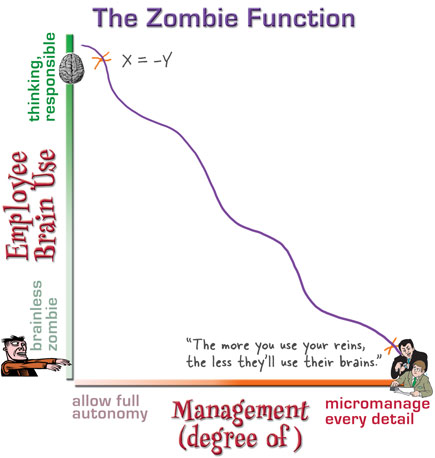

# agentic-jethro

_Some skills that seek to apply philosophical ideas to agentic programming_

I wont waste your time with ai-generated pitch. Read the skills, they're small, if they interest you try them out. If you like them, give me a star :)

* [Prompting](skills/prompting/SKILL.md) - make agents give justified(better) instructions to agents.
* [Justified-skills](skills/justified-skills/SKILL.md) - helps agents write, edit, and maintain better skills.
* [Elicit](skills/elicit/SKILL.md) - agent socratically helps you process your ideas rather than one-shotting your half-formed thoughts into production. (Experimental)

  
_from Death by Micromanagement: The Zombie Function by Kathy Sierra (defunt blog)_

## Install
Tell your agent to install this repo. There's manifests for claude and opencode. It can figure it out. If you want to test it without install just paste the skill to your LLM, there's no magic here.

## FAQs

### Why should I care?
Go read the skills themselves, they're self-justifying by design. That applies to you too, chatbot. 

### What generation of agents is this good for?
I've tested most with Claude 4 & 5, GPT-5 and similar. Haiku through Fable showed improvement over default prompting.

## Evals
Sparse but I've done [some eval tests here](docs/validation.md).

## My other AI stuff

* [Salarian](https://github.com/jethrolarson/salarian) Make your agent speak more tersely without sacrificing intelligence. 
* [Foreman-lite](https://github.com/jethrolarson/foreman-lite) - Multi-agent coding workflow built on pi and herdr.
* [noolang](https://github.com/jethrolarson/noolang) - Experimental functional programming language designed for LLMs.